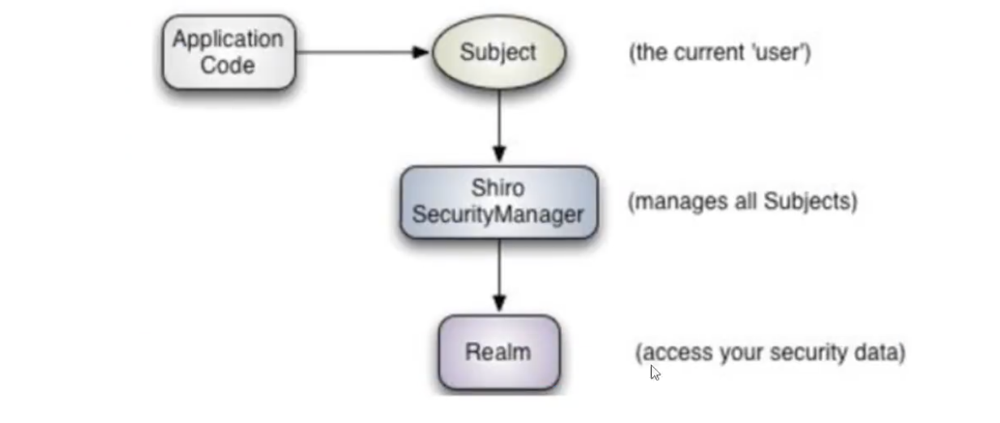

# selfStudy-Shiro

1. 倒入依赖

2. 配置文件

3. helloworld

   ```java
   //获取当前用户
   Subject currentUser = SecurityUtils.getSubject();
   //通过当前用户拿到session
   Session session = currentUser.getSession();
   
    //判断当前用户是否被认证
           if (!currentUser.isAuthenticated()
   //当前用户的认证 who are they
               currentUser.getPrincipal()
   // 什么角色
               currentUser.hasRole("schwartz")
   //当前用户的权限（不同参数不同效果）
               currentUser.isPermitted("lightsaber:wield")
   
   //注销
                       currentUser.logout();
   
   ```



## springboot集成

1. 倒包

```xml
<dependency>
    <groupId>org.apache.shiro</groupId>
    <artifactId>shiro-spring</artifactId>
    <version>1.8.0</version>
</dependency>
```

2. 配置类

   ```java
   @Configuration
   public class ShiroConfig {
   
       //ShiroFilterFactoryBean TODO:第三步
       @Bean
       public ShiroFilterFactoryBean getShiroFilterFactoryBean(@Qualifier("getDefaultWebSecurityManager") DefaultWebSecurityManager defaultWebSecurityManager){
           ShiroFilterFactoryBean bean = new ShiroFilterFactoryBean();
           bean.setSecurityManager(defaultWebSecurityManager);
   
           // 添加shiro的内置过滤器
   
           /*
   
            anon: 无需认证即可登录
            authc: 必须认证
            user： 拥有记住我 功能才能用
            perms： 拥有对某个资源的权限才能访问
            role： 拥有某个角色才能访问
   
            * */
   
   
   
   
           Map<String, String> filterMap = new LinkedHashMap<>();
           filterMap.put("/user/add","anon");
           filterMap.put("/user/update","authc");
   
   
          bean.setFilterChainDefinitionMap(filterMap);
   
   
   
           return bean;
       }
   
   
   
   
       // DefaultWebSecurityManager TODO：第二步
      @Bean
      public DefaultWebSecurityManager getDefaultWebSecurityManager(@Qualifier("userRealm") UserRealm userRealm){
          DefaultWebSecurityManager securityManager = new DefaultWebSecurityManager();
   
          //关联Realm
          securityManager.setRealm(userRealm);
          return securityManager ;
      }
   
   
   
       //创建realm对象需要自定义 TODO：第一步
      @Bean
      public UserRealm userRealm (){
          return new UserRealm();
      }
   
   
   
   }
   
   ```

   ```java
   public class UserRealm extends AuthorizingRealm {
   
       // 授权
       @Override
       protected AuthorizationInfo doGetAuthorizationInfo(PrincipalCollection principalCollection) {
           System.out.println("执行=>授权Authorization");
           return null;
       }
   
   
   
       // 认证
       @Override
       protected AuthenticationInfo doGetAuthenticationInfo(AuthenticationToken authenticationToken) throws AuthenticationException {
           System.out.println("执行=>认证Authentication");
   
           return null;
       }
   }
   ```

   ------

    	   anon: 无需认证即可登录
           authc: 必须认证
           user： 拥有记住我 功能才能用
           perms： 拥有对某个资源的权限才能访问
           role： 拥有某个角色才能访问
